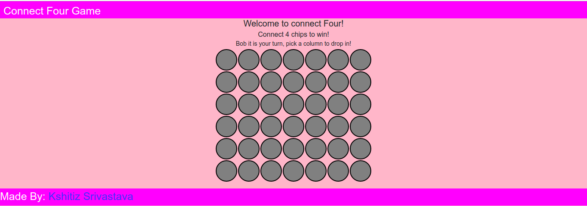
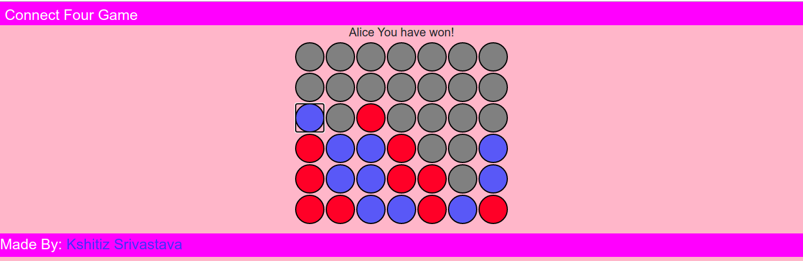

# Connect-Four-Game:
A nice and simple project made to learn/practise JavaScript and jQuery.
  
The game has dual player mode allowing 2 players (with each player color coded) to simultaneously interact and make their move in order to win by connecting 4 consecutive dots in any direction. 
## ScreenShots Attached:

## How to run locally?
* Just clone the repository and open index.html file, you are good to go.

## Mentor:
* [Kshitiz Srivastava](https://contrihub21.herokuapp.com/profile/user/pirateksh/)
